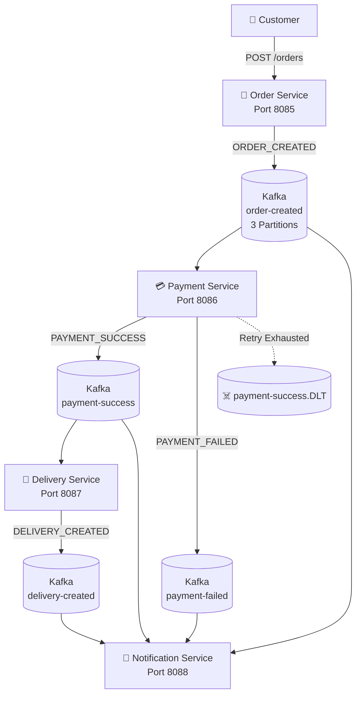

# 🚀 Kafka Order Processing System

> **Event-driven Order Processing System built using Spring Boot Microservices and Apache Kafka**


---

## 📌 Project Overview

This project implements an **event-driven Order Processing System** using four independent Spring Boot microservices and Apache Kafka.

Instead of relying entirely on direct synchronous communication, the services communicate asynchronously through **Kafka events**.

The project demonstrates practical Kafka concepts including:

- ⚡ Asynchronous communication
- 📤 Kafka Producers
- 📥 Kafka Consumers
- 📚 Kafka Topics
- 🔀 Kafka Partitions
- 🔑 Kafka Message Keys
- 👥 Consumer Groups
- 📍 Consumer Offsets
- 📈 Consumer Scaling
- 🔄 Failure Recovery
- 🔁 Retry Handling
- ♻️ Idempotency
- ☠️ Dead Letter Topics (DLT)

---

# 🏗️ System Architecture



---

# 🔄 End-to-End Event Flow

```text
                         👤 CUSTOMER
                              |
                              | POST /orders
                              ↓
                    ┌─────────────────────┐
                    │   🛒 Order Service   │
                    │      Port 8085      │
                    └──────────┬──────────┘
                               |
                         ORDER_CREATED
                               |
                               ↓
                    ┌─────────────────────┐
                    │ Kafka: order-created│
                    │    3 Partitions     │
                    └──────────┬──────────┘
                               |
                               ↓
                    ┌─────────────────────┐
                    │  💳 Payment Service │
                    │      Port 8086      │
                    └──────┬───────┬──────┘
                           |       |
            PAYMENT_SUCCESS|       |PAYMENT_FAILED
                           |       |
                           ↓       ↓
                  ┌────────────┐  ┌─────────────┐
                  │ payment-   │  │ payment-    │
                  │ success    │  │ failed      │
                  └─────┬──────┘  └──────┬──────┘
                        |                |
                        ↓                |
               ┌─────────────────┐       |
               │ 🚚 Delivery     │       |
               │    Service      │       |
               │    Port 8087    │       |
               └────────┬────────┘       |
                        |                |
                  DELIVERY_CREATED       |
                        |                |
                        ↓                ↓
               ┌─────────────────────────────┐
               │ 🔔 Notification Service     │
               │          Port 8088          │
               └─────────────────────────────┘
```

---

# 🧩 Microservices

| Service | Port | Responsibility |
|---|---:|---|
| 🛒 **Order Service** | `8085` | Creates orders and publishes `ORDER_CREATED` events |
| 💳 **Payment Service** | `8086` | Processes payments and publishes payment events |
| 🚚 **Delivery Service** | `8087` | Creates deliveries after successful payment |
| 🔔 **Notification Service** | `8088` | Consumes events and simulates notifications |

---

# 🛠️ Technology Stack

| Technology | Purpose |
|---|---|
| ☕ **Java 21** | Application development |
| 🌱 **Spring Boot 4.1.1** | Microservice framework |
| 📨 **Spring Kafka** | Kafka integration |
| 🔥 **Apache Kafka** | Event-driven communication |
| 🗄️ **MySQL** | Order and delivery persistence |
| 🧩 **Spring Data JPA** | Data access |
| 🏗️ **Hibernate** | ORM |
| 🐳 **Docker** | Kafka infrastructure |
| 📦 **Maven** | Build and dependency management |
| 🚀 **Postman** | API testing |
| 💻 **Eclipse IDE** | Development environment |

---

# 📂 Project Structure

```text
kafka-order-processing-system/
│
├── 📄 README.md
├── 📄 .gitignore
│
├── 📁 docs/
│   ├── 📄 Kafka-Order-Processing-System-Report.pdf
│   │
│   ├── 📁 architecture/
│   │   └── 🖼️ architecture.png
│   │
│   └── 📁 screenshots/
│       ├── 01-order-service.png
│       ├── 02-payment-success.png
│       ├── 03-payment-failed.png
│       ├── 04-delivery-created.png
│       ├── 05-kafka-partitions.png
│       ├── 06-consumer-groups.png
│       ├── 07-consumer-scaling.png
│       ├── 08-failure-recovery.png
│       ├── 09-retry.png
│       ├── 10-dlt.png
│       └── 11-idempotency.png
│
├── 📁 postman/
│   └── Kafka-Order-Processing-System.postman_collection.json
│
├── 📁 project-kafka-order-service/
│   ├── pom.xml
│   └── src/
│
├── 📁 project-kafka-payment-service/
│   ├── pom.xml
│   └── src/
│
├── 📁 project-kafka-delivery-service/
│   ├── pom.xml
│   └── src/
│
└── 📁 project-kafka-notification-service/
    ├── pom.xml
    └── src/
```

---

# 📨 Kafka Topics

| Kafka Topic | Partitions | Purpose |
|---|---:|---|
| `order-created` | `3` | Publishes newly created order events |
| `payment-success` | `3` | Publishes successful payment events |
| `payment-failed` | `3` | Publishes failed payment events |
| `delivery-created` | `3` | Publishes delivery creation events |
| `payment-success.DLT` | `3` | Stores messages after retry exhaustion |

> 💡 **Note:** The main Kafka topics were configured with **3 partitions**.

---

# 🔑 Kafka Message Key

The `orderId` is used as the Kafka message key when publishing the `ORDER_CREATED` event.

```text
Key:
orderId = 100

Value:
ORDER_CREATED event
```

Using `orderId` as the message key allows messages for the same order to be routed consistently to the same Kafka partition.

---

# 👥 Kafka Consumer Groups

## 💳 Payment Service

```text
payment-service-group
```

Consumes:

```text
order-created
```

---

## 🚚 Delivery Service

```text
delivery-service-group
```

Consumes:

```text
payment-success
```

---

## 🔔 Notification Service

```text
notification-service-group
```

Consumes:

```text
order-created
payment-success
payment-failed
delivery-created
```

---

# 🔀 Kafka Partitions

The main Kafka topics use **3 partitions**.

Example:

```text
order-created
│
├── Partition 0
├── Partition 1
└── Partition 2
```

Partitions allow Kafka to distribute messages and support parallel consumption.

---

# 📈 Consumer Scaling

Payment Service was tested using multiple instances belonging to the same consumer group.

```text
                payment-service-group
                         │
             ┌───────────┴───────────┐
             │                       │
             ↓                       ↓
    💳 Payment Service       💳 Payment Service
       Instance 1               Instance 2
             │                       │
             └───────────┬───────────┘
                         ↓
                  Kafka Partitions
```

When multiple consumers belong to the same consumer group, Kafka distributes available partitions between the active consumers.

### What this demonstrates

- 👥 Same consumer group
- 🔀 Multiple partitions
- 📈 Horizontal consumer scaling
- ⚡ Parallel message consumption

---

# 📍 Consumer Offsets

Kafka consumer groups maintain offsets for consumed messages.

The project was tested using Kafka consumer-group commands to inspect:

- Current Offset
- Log End Offset
- Consumer ID
- Topic
- Partition
- Lag

The demonstrated consumer groups reached **zero lag after successful processing**.

---

# 🔄 Failure & Recovery

A failure scenario was intentionally tested by stopping the **Payment Service** while an order event was available in Kafka.

The event remained available in Kafka while the Payment Service was unavailable.

After restarting the Payment Service, the pending event was consumed and processing continued.

### Failure Recovery Flow

```text
🛒 Order Service
       |
       ↓
ORDER_CREATED
       |
       ↓
📨 order-created
       |
       ↓
❌ Payment Service OFF
       |
       ↓
📦 Message remains in Kafka
       |
       ↓
✅ Payment Service ON
       |
       ↓
💳 Payment Service consumes event
       |
       ↓
💰 PAYMENT_SUCCESS
       |
       ↓
🚚 Delivery Service
       |
       ↓
📦 DELIVERY_CREATED
```

This demonstrates Kafka-based message retention and service recovery.

---

# 🔁 Retry Handling

Retry handling was implemented in the Payment Service using Spring Kafka error handling.

When message processing fails, the message is retried before being routed to the Dead Letter Topic.

### Retry Flow

```text
📨 Message
    |
    ↓
🔵 Initial Attempt
    |
    ↓
🟡 Retry #1
    |
    ↓
🟡 Retry #2
    |
    ↓
🔴 Retry Exhausted
    |
    ↓
☠️ payment-success.DLT
```

The implementation uses a fixed retry interval before the failed message is routed to the DLT.

---

# ☠️ Dead Letter Topic (DLT)

The project implements the following Dead Letter Topic:

```text
payment-success.DLT
```

An intentionally invalid message was sent to the `order-created` topic:

```text
THIS IS NOT A VALID JSON
```

The Payment Service failed while processing the invalid message.

After the configured retry attempts were exhausted, the message was successfully routed to:

```text
payment-success.DLT
```

### DLT Flow

```text
📨 order-created
       |
       ↓
💳 Payment Service
       |
       ↓
❌ JSON Processing Failure
       |
       ↓
🔁 Retry #1
       |
       ↓
🔁 Retry #2
       |
       ↓
🚫 Retry Exhausted
       |
       ↓
☠️ payment-success.DLT
```

---

# ♻️ Idempotency

Idempotency was implemented using the `eventId` of the Kafka event.

### Example Event

```json
{
  "eventId": "DUP-10001",
  "eventType": "ORDER_CREATED",
  "orderId": 100,
  "customerId": 101,
  "amount": 50000,
  "deliveryAddress": "Bangalore"
}
```

The same event was intentionally sent twice.

### First Event

```text
eventId = DUP-10001
        |
        ↓
✅ Event processed
        |
        ↓
💰 Payment successful
```

### Duplicate Event

```text
eventId = DUP-10001
        |
        ↓
🔍 Event already processed
        |
        ↓
♻️ Duplicate event ignored
```

The Payment Service logged:

```text
Duplicate event ignored. EventId: DUP-10001
```

This prevents duplicate processing of the same event.

> ⚠️ **Implementation Note:** The current demonstration uses an in-memory set for tracking processed event IDs. In a production system, idempotency keys would typically be persisted in a database or distributed store such as Redis.

---

# 💰 Payment Success Flow

```text
ORDER_CREATED
      |
      ↓
💳 Payment Service
      |
      ↓
Amount > 0
      |
      ↓
✅ PAYMENT_SUCCESS
      |
      ↓
📨 payment-success
      |
      ↓
🚚 Delivery Service
      |
      ↓
📦 DELIVERY_CREATED
```

---

# ❌ Payment Failure Flow

```text
ORDER_CREATED
      |
      ↓
💳 Payment Service
      |
      ↓
Amount <= 0
      |
      ↓
❌ PAYMENT_FAILED
      |
      ↓
📨 payment-failed
      |
      ↓
🔔 Notification Service
```

---

# 🧪 API Testing

The Order Service exposes:

```text
POST http://localhost:8085/orders
```

### Example Request

```json
{
  "customerId": 101,
  "customerName": "Rahul",
  "productId": 501,
  "productName": "Laptop",
  "quantity": 1,
  "amount": 75000,
  "deliveryAddress": "Bangalore"
}
```

### Example Response

```json
{
  "orderId": 1,
  "status": "CREATED"
}
```

The created order is stored in MySQL and an `ORDER_CREATED` event is published to Kafka.

---

# 📮 Postman

The Postman collection used for API testing is available under:

```text
postman/Kafka-Order-Processing-System.postman_collection.json
```

Import the collection into Postman to test the Order Service API.

---

# 🐳 Docker & Kafka Setup

Kafka is running through Docker.

### Kafka Broker

```text
localhost:9092
```

### List Kafka Topics

```bash
docker exec -it kafka kafka-topics --bootstrap-server localhost:9092 --list
```

---

# 🧰 Useful Kafka Commands

<details>
<summary>📨 Consume order-created</summary>

```bash
docker exec -it kafka kafka-console-consumer --bootstrap-server localhost:9092 --topic order-created --from-beginning
```

</details>

<details>
<summary>💰 Consume payment-success</summary>

```bash
docker exec -it kafka kafka-console-consumer --bootstrap-server localhost:9092 --topic payment-success --from-beginning
```

</details>

<details>
<summary>❌ Consume payment-failed</summary>

```bash
docker exec -it kafka kafka-console-consumer --bootstrap-server localhost:9092 --topic payment-failed --from-beginning
```

</details>

<details>
<summary>🚚 Consume delivery-created</summary>

```bash
docker exec -it kafka kafka-console-consumer --bootstrap-server localhost:9092 --topic delivery-created --from-beginning
```

</details>

<details>
<summary>☠️ Consume Dead Letter Topic</summary>

```bash
docker exec -it kafka kafka-console-consumer --bootstrap-server localhost:9092 --topic payment-success.DLT --from-beginning
```

</details>

---

# 👀 Consumer Group Commands

<details>
<summary>💳 Payment Service Consumer Group</summary>

```bash
docker exec -it kafka kafka-consumer-groups --bootstrap-server localhost:9092 --describe --group payment-service-group
```

</details>

<details>
<summary>🚚 Delivery Service Consumer Group</summary>

```bash
docker exec -it kafka kafka-consumer-groups --bootstrap-server localhost:9092 --describe --group delivery-service-group
```

</details>

<details>
<summary>🔔 Notification Service Consumer Group</summary>

```bash
docker exec -it kafka kafka-consumer-groups --bootstrap-server localhost:9092 --describe --group notification-service-group
```

</details>

---

# 🔍 Topic Partition Commands

<details>
<summary>📨 order-created</summary>

```bash
docker exec -it kafka kafka-topics --bootstrap-server localhost:9092 --describe --topic order-created
```

</details>

<details>
<summary>💰 payment-success</summary>

```bash
docker exec -it kafka kafka-topics --bootstrap-server localhost:9092 --describe --topic payment-success
```

</details>

<details>
<summary>❌ payment-failed</summary>

```bash
docker exec -it kafka kafka-topics --bootstrap-server localhost:9092 --describe --topic payment-failed
```

</details>

<details>
<summary>🚚 delivery-created</summary>

```bash
docker exec -it kafka kafka-topics --bootstrap-server localhost:9092 --describe --topic delivery-created
```

</details>

<details>
<summary>☠️ payment-success.DLT</summary>

```bash
docker exec -it kafka kafka-topics --bootstrap-server localhost:9092 --describe --topic payment-success.DLT
```

</details>

---

# ▶️ How to Run

### 1️⃣ Start Docker

Make sure Docker Desktop is running.

Start the Kafka/Zookeeper environment used by the project.

### 2️⃣ Verify Kafka

Verify that Kafka is available at:

```text
localhost:9092
```

### 3️⃣ Create Required Kafka Topics

Create the following topics if they do not already exist:

- `order-created`
- `payment-success`
- `payment-failed`
- `delivery-created`
- `payment-success.DLT`

The project uses **3 partitions** for these topics.

### 4️⃣ Configure MySQL

Create the required MySQL database:

```text
18lpa_preparation
```

Configure the database credentials in each service's local configuration.

> 🔐 **Important:** Do not commit database passwords or other secrets to GitHub. Use environment variables or local configuration for sensitive credentials.

### 5️⃣ Start the Microservices

Start the services:

```text
🛒 Order Service        → 8085
💳 Payment Service      → 8086
🚚 Delivery Service     → 8087
🔔 Notification Service → 8088
```

### 6️⃣ Test Using Postman

Send:

```text
POST http://localhost:8085/orders
```

using the sample request provided above.

### 7️⃣ Verify Kafka Events

Verify:

```text
order-created
      ↓
payment-success / payment-failed
      ↓
delivery-created
```

Notification Service consumes the relevant events and prints simulated notification messages.

---

# 📊 End-to-End Event Pipeline

```text
          👤 CUSTOMER
               |
               ↓
        🛒 ORDER SERVICE
               |
               ↓
       📨 ORDER_CREATED
               |
               ↓
      ┌─────────────────┐
      │ order-created   │
      │ 3 Kafka         │
      │ partitions      │
      └────────┬────────┘
               |
               ↓
       💳 PAYMENT SERVICE
          /           \
         /             \
        ↓               ↓
   ✅ SUCCESS        ❌ FAILED
        |               |
        ↓               ↓
payment-success   payment-failed
        |
        ↓
 🚚 DELIVERY SERVICE
        |
        ↓
 DELIVERY_CREATED
        |
        ↓
delivery-created
        |
        ↓
🔔 NOTIFICATION SERVICE
```

---

# 🧠 Kafka Concepts Demonstrated

| Concept | Demonstrated |
|---|:---:|
| 📤 Kafka Producer | ✅ |
| 📥 Kafka Consumer | ✅ |
| 📨 Kafka Topics | ✅ |
| 🔀 Kafka Partitions | ✅ |
| 🔑 Message Keys | ✅ |
| 👥 Consumer Groups | ✅ |
| 📍 Consumer Offsets | ✅ |
| 📈 Consumer Scaling | ✅ |
| ⚡ Asynchronous Communication | ✅ |
| 🔄 Failure Recovery | ✅ |
| 🔁 Retry Handling | ✅ |
| ♻️ Idempotency | ✅ |
| ☠️ Dead Letter Topic | ✅ |
| 🧩 Event-Driven Architecture | ✅ |
| 🔗 Microservice Communication | ✅ |

---

# 🧪 Testing Scenarios

The following scenarios were implemented and tested:

| Test Scenario | Status |
|---|:---:|
| 🛒 Order creation | ✅ |
| 💰 Successful payment | ✅ |
| ❌ Failed payment | ✅ |
| 🚚 Delivery creation | ✅ |
| 🔔 Notification consumption | ✅ |
| 🔀 Kafka partitions | ✅ |
| 👥 Consumer groups | ✅ |
| 📈 Consumer scaling | ✅ |
| 🔄 Failure & recovery | ✅ |
| 🔁 Retry handling | ✅ |
| ☠️ Dead Letter Topic | ✅ |
| ♻️ Duplicate event detection | ✅ |
| 🛡️ Idempotency | ✅ |

---

# 📸 Project Evidence

Implementation screenshots and demonstration evidence are available under:

```text
docs/screenshots/
```

The screenshots cover:

- 🛒 Order Service
- 💰 Payment Success
- ❌ Payment Failure
- 🚚 Delivery Creation
- 🔀 Kafka Partitions
- 👥 Consumer Groups
- 📈 Consumer Scaling
- 🔄 Failure & Recovery
- 🔁 Retry Handling
- ☠️ Dead Letter Topic
- ♻️ Idempotency

---

# 📄 Project Report

The complete project report is available at:

```text
docs/Kafka-Order-Processing-System-Report.pdf
```

The report contains:

- 📐 Project architecture
- 🧩 Microservice implementation
- 📨 Kafka configuration
- 🔀 Kafka partitions
- 👥 Consumer groups
- 📈 Consumer scaling
- 🔄 Failure and recovery demonstration
- 🔁 Retry implementation
- ☠️ Dead Letter Topic implementation
- ♻️ Idempotency implementation
- 🧪 Testing evidence
- 📸 Screenshots

---

# 📁 Repository Structure

```text
kafka-order-processing-system/
│
├── 📄 README.md
├── 📄 .gitignore
│
├── 📁 docs/
│   ├── 📄 Kafka-Order-Processing-System-Report.pdf
│   │
│   ├── 📁 architecture/
│   │   └── 🖼️ architecture.png
│   │
│   └── 📁 screenshots/
│       ├── 01-order-service.png
│       ├── 02-payment-success.png
│       ├── 03-payment-failed.png
│       ├── 04-delivery-created.png
│       ├── 05-kafka-partitions.png
│       ├── 06-consumer-groups.png
│       ├── 07-consumer-scaling.png
│       ├── 08-failure-recovery.png
│       ├── 09-retry.png
│       ├── 10-dlt.png
│       └── 11-idempotency.png
│
├── 📁 postman/
│   └── 📄 Kafka-Order-Processing-System.postman_collection.json
│
├── 📁 project-kafka-order-service/
│   ├── 📄 pom.xml
│   └── 📁 src/
│
├── 📁 project-kafka-payment-service/
│   ├── 📄 pom.xml
│   └── 📁 src/
│
├── 📁 project-kafka-delivery-service/
│   ├── 📄 pom.xml
│   └── 📁 src/
│
└── 📁 project-kafka-notification-service/
    ├── 📄 pom.xml
    └── 📁 src/
```

---

# 🎯 Key Learning Outcomes

Through this project, I gained practical experience with:

1. Building event-driven microservices using Spring Boot.
2. Integrating Apache Kafka with Spring Boot.
3. Publishing and consuming Kafka events.
4. Working with Kafka topics and partitions.
5. Using Kafka message keys.
6. Understanding consumer groups and offsets.
7. Scaling Kafka consumers.
8. Handling service failures and recovery.
9. Implementing retry mechanisms.
10. Implementing event-level idempotency.
11. Handling failed messages using Dead Letter Topics.
12. Understanding asynchronous microservice communication.

---

# 🔮 Production Considerations

This project focuses on demonstrating Kafka and microservice concepts in a practical development environment.

For a production-grade implementation, additional considerations would include:

- 🗄️ Persistent idempotency storage
- ⚡ Distributed caching where required
- 🛡️ Kafka replication and fault tolerance
- 📋 Event schema management
- 🔢 Event versioning
- 📝 Centralized logging
- 📊 Monitoring and alerting
- 🔍 Distributed tracing
- 🔐 Secure Kafka authentication and authorization
- ⚙️ Externalized configuration
- 🔑 Secret management
- 🐳 Container orchestration
- 💾 Database transaction consistency
- 🔄 Reliable event publishing strategies

---

# 🚀 Future Enhancements

Possible future improvements include:

- [ ] Persistent idempotency using MySQL or Redis
- [ ] Centralized configuration
- [ ] Service discovery
- [ ] API Gateway
- [ ] Distributed tracing
- [ ] Prometheus and Grafana monitoring
- [ ] Kafka Schema Registry
- [ ] Event versioning
- [ ] Authentication and authorization
- [ ] Docker Compose deployment
- [ ] Kubernetes deployment

---

# 🏆 Project Highlights

> ### 🔥 What makes this project valuable?

This project goes beyond simply producing and consuming Kafka messages.

It demonstrates a complete event-driven workflow with:

**Microservices → Kafka → Partitions → Consumer Groups → Scaling → Failure Recovery → Retry → Idempotency → DLT**

The project also includes practical failure scenarios and duplicate-event handling to demonstrate how Kafka-based systems can be designed to handle real-world messaging challenges.

---

# 👨‍💻 Author

## Shubham Mahajan

**Software Developer | Java Backend | Spring Boot | Apache Kafka**

Focused on building backend systems, event-driven applications, and scalable microservices.

---

# ⭐ Project Purpose

This project was developed to gain practical experience with:

**Java + Spring Boot + Apache Kafka + Microservices + Event-Driven Architecture**

and to understand how asynchronous communication, Kafka topics, partitions, consumer groups, offsets, consumer scaling, failure recovery, retries, idempotency, and Dead Letter Topics work together in a practical microservices-based Order Processing System.

---

# 📚 Documentation

📄 **Complete Project Report**

`docs/Kafka-Order-Processing-System-Report.pdf`

📸 **Screenshots**


`docs/screenshots/`

🖼️ **Architecture**

`docs/architecture/`

📮 **Postman Collection**

`postman/Kafka-Order-Processing-System.postman_collection.json`

---

# ❤️ Built With

**Java ☕ | Spring Boot 🌱 | Apache Kafka 📨 | MySQL 🗄️ | Docker 🐳 | Microservices 🧩**

---

⭐ If you find this project useful, feel free to explore the implementation and documentation.
